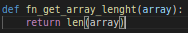

# data-structures-and-algorithms

Data structures and algorithms are usually the begging in the process of writting scalable software. the more requests your system has the more important it is to have a optimized algorithm (we understand optimized algorithm as those with the better time and space complexity .there are some weird cases where a better time complexity does not mean a better algotithm but are a few a will see some examples. Explanation of what time and space complexity is in sections below.

At the botom of this readMe file is **the most important thing in this journey**, the exercises where the concepts are apply.

I also would like to encourage you to try to explain all of these concepts and exercises because the best way of learning something is teaching it. Apart from that we should always try to give back something to the software community we owe so much.

## Concepts

### 1. Time and spacial complexity

Time complexity is a way of describing how long would it take for an algorithm to complete a task depending on the amount of data that it is receiving as input, for example in the algorimn below we are printing all of the elements in the array.

If the input for this function is an array of lenght 4 it would take half the time that it would take if the lenght of the array was 8. The difference between 8 milliesconds and 4 millisecons is not reaaly significant but when we are talking of millions of records thats when the time complexity of the algoithm is important.

There are several types of time complexity, constant O(1), linear O(n), logaritmic O(logn), linearitmic O(nlogn), cuadratic  O(n^2), cubic O(n^3), exponentioal O(2^n) and factorial O(n!)

In the picture they are using the Big O notation, (well, almost everybody use big O notation). this is a convention used to describe an approximation of how long will it take for our algoritm to finish its job. in our first function the notation would be O(n), this mean that given an input of size n our task would take n units of time.

The Big O notation for our first function would be linear, for the picture below the time complexity would be constant. Constant time complexity means that it does not matter the amount of data it will always take the same amount of time to complete the job.

For me the best way to define a logaritmic time complexity is saying that is a function that in every iteration rule out half of the remaining elements in the input, the best example of a function with logaritmic time complexity would be the binary search.

First off, binary search require the elements of the array to be already sorted. The inputs for binarySearch are an array, a variable for the leftmost and rightmost position in the array and the variable that we are looking for. In every iteration we ask if the position in the middle is equal to the variable that we are looking for.

If the position in the middle is not equal to the variable we are looking then we need to ask ourself if the variable in the middle is greater or smaller then the variable we are looking for, depending on the answer the value of right will be middle plus 1 or the value of left will be middle minus 1.

Notice in the picture below how in every iteration we are ruling out half of the elements in the array. In the picture after that there is an implementation of the binary search

A function with linearitmic time complexity is a function where we are using a logaritmic function everytime there is an element in the array, for example, imagine that that I receive a sorted array and for some reason I would like to apply the binary search in every iteration of the for loop (this funcion would not make any sense in the real world but for explaining linearimic functions is great).

Is important to have in mind that O(nlogn) means that the linear size of the function and the logaritmic part of the function apply on the same dataset, if we are applying the logaritmic function in a diferent dataset that would be O( nlogm ) because we can not use the same variable for two different things.

A function with cuadratic time complexity is a functiong where for each element in the dataset we are iterating throug all of the elements in the same dataset, if it is not the same dataset then we would call it O(mn) (an example in the picture below).

A cubic function would be one function where for every element in the datasest we are using a function with cuadratic time complexity, in the same way a function with n^4 time complexity would be one function where for every element in the dataset we are using a cubic function, and so on with  n^5, n^6, n^7 etc...

A function with exponential time complexity means that we are having a number of iterations equal to 2 pows the dataset size (O2^n). A great example of these algorithms is the one we used in problme number 1863, where we have to create all of the subsets of a given array.

For competitive programming there are only two types of important spacial complexity O(1) meaning that you are creating new variables in every iteration and the non-constant meaning that you are doing it.

### 2. storing two numbers in one using bitmasking, exrcise 1920

When you need two arrays, one for input and another for answer but can only use one (like in this occasion when they require constant space complexity) we will need to store two numbers in one. Notice that all numbers must be equal or less than the array lenght and the maximun lenght size is 1000. Binary representation of 1000 has 10 digits (1111101000) so we need to a number which binary representation has 10 digits and they all 1's (1023).

The easiest way to store two numbers is expanding the first number using a mask, in this way the mask will work as the limit for the begging of the first number and the begging of the second one.

Imagine that we want to store 8 and 3 in the same number. The binary representation of 3 is 11 and the binary of 8 is 1000.

The first thing that wee need to do is applying the mask 1023 with the "&" operator. The "&" operator apply the "AND" gate of true so it will only be true if both bits are set (in other words if both digits are 1). For our purpose applying this mask will always gave back the first 10 digits of the number like we see in the picture below.

The second part is expanding the second  number using the mask.

After that we are storing the second number in the next 10 bits. To do that first wee need to move the binary representation of 8 (1000) 10 spaces to the right so we dont modify the first number (this is call bit shifting), after that we place the shifted number in the three value using the "|" operator, this apply and "OR" gate of true.

###  3. Given two points, finding the function, exercise 1512

Exercise 1512 is the type of exercise where is better to see it as three different problems, the firt problem is counting the appeareances of every number , the second one would be given a n number of apperance for every number how many pairs does it  
f(x) = mx + n, where m is the slope and n is the intersetction with the x axis (horizontal axis). When you have two unknown variables (in our case m and n) you must use an equation system like the exercise shown in this [video](https://www.youtube.com/watch?v=Qcq3PQSZotI) ..... it is in spanish, I will create an english version of every video or documentation, is already listed in my to-do list

### 4 sorting algoritms, exercise 1528

There are three important sorting algoritms, the quicksort, the mergesort and heapsort. In this readMe file we will mention some other sorting algoritms but it is very likely that you will never use them.

Quicksort is the most used, it has a time complexity of O(nlogn), space complexity of O(logn) and operate in place. It can have a time complexity of O(2^n) in its worst case escenario (when they array is already sorted and when all of the elements are the same) but for most cases it is faster than heapsort and mergesort. Quicksort is one of the best examples that a better time complexity is not always a better algoritm given the existence of sorting algoritms like  . These are some of the few cases where a better time complexity does not mean a better algoritm, but again, these are isolated cases, for most cases a better time complexity means more scalability.

Another edge case where quicksort is not the most optmial option is when the dataset is really tiny (like 15 elements) in these case insert sort could be faster, but in competitive programming or in real life algoritms are expected to scale 

The purpose of this Readme file is give you the skill for a competitive-programing like situation. for a more in detail explanation of quicksort performance and worst case scenario I recommend the book "Thomas H. Cormen, Charles E. Leiserson, Ronald L. Rivest, Clifford Stein Introduction to Algorithms, Third Edition  2009".

Another great book if you want to dive deeper is "Algorithhms 4th Edition by Robert Sedgewick, Kevin Wayne".

MergeSort also has a time complexity of O(nlogn), spacial complexity of O(n) and it does not operate in-place

heapsort has a time compllexity of O(nlogn),  space complexity of o(1) and it operate in-place. This one is the algoritm that we use when we are using priority queue, it has a two great attributes and that is that some times we dont really want to to sort the whole array, we just want to store one element in its correct position in the data structure. The other one is that using the comparator class we can sort the data-structure for multiple attributes.

A sorting algoritmh is stable if it preserves the relative order of equal keys in the array, ( insertion sort
and mergesort are stable, selection sort, shellsort, quicksort, and heapsort are not (heapsort using priority queue can use a seconda atribute for comparisions throush the comparator interface).

When we are sorting data ussually we are not jus sorting the keys but also the rest of the data in every record, that is called satellite data

bubbleSort operate in place but it operate in O(n)

concepts to mention, key, record , satellite data, stability

### 5 logic gates  1528

If you are reading this you are a programmer and most likely you are already familiar with the gates of true "AND" "OR" because we use them a lot in our conditional statement in java or python.

Now XOR is something new or at least a not so used gate of true. in XOR the result is true if both of them are different like we see in the picture below

Now to do the xor between two numbers we are doing the xor between the binary representation of both numbers so 3 xor 8 would be 11 xor 1000 anthe result would be  1011 (11 in decimal) because the first two numbers from right to left  are different the result is true (1) in the third location both are equal so the result is 0 and in the last one. A picture below for a better visualization of the concept.

Now, to solve the problem 1528 the first thing that we need to do is find a number that xorted agains the number given in variable "first" result in the first element in the array "encoded". 

So in the example 2 of the exercise we have the first element of the array we have to return and the second element will be a number that that xorted against 4 result in 6.

The easiest way to do it is just xor 4 and 6 and that will give us the second element because ----> if (4 ^ 6 = x) then (4 ^ x = 6) 

### 6 when you need to sort by two values , exercise 1389

Notice that you could have several number with the same index, and the way we know the real position is using the position of the number in the array nums.

The way I would do it is using the priorityQueue and the comparator interface 

### 7 when you need to sort by two values , exercise 1389

### 8 Binary tree (full,complete, perfect,Binary search tree) case 108

A full binary tree is a data structure where the nodes that decide to have children have two children, a complete binary tree is a data structure where we fill the tree from top to bottom and from left to right and the perfect binary tree is a binary tree that is both full and complete.

picture taken from this link, you should check that channel is amazing

### Summation

(n(n+1)) / 2   useful for problems like leetcode number 268

### prefix sum array and suffix array

A suffix array is a sorted array of all of the suffixes of a given array (video [explanation](https://www.youtube.com/watch?v=uxA__b23t2w&t=30s) ) , the prefix (could not find a good explanation of prefix array so following the leetcode problem number 654 as a guide we will asume that a prefix array is a counter part of a suffix array). The prefix sum array is (you know what, this explanation is [better](https://www.geeksforgeeks.org/prefix-sum-array-implementation-applications-competitive-programming/) ), I know the inverted prefix sum array (starting from the last element of the array until the first element) has a name but I don't remember what it is

### ???? greedy problems

I would like to sound smart, but I won't sound smarter than [this](https://www.geeksforgeeks.org/greedy-algorithms/), for a better undestanding of the greedy algoritm see leetcode problem number 1710

### ???? data structures (why I use hashmap so much)

### ???? how to know if two elements are in the same diagonal

### ???? preorder postorder inorder

### ???? sliding window

### ???? dfs , bfs

### ???? recursion and how careful we have to be with it

# Useful tips

1. Read markdown documentation to learn useful trick to apply in this ReadMe file or another file that you prefer.

# leetcode array exercises, easy level

1. exercise [link](https://leetcode.com/problems/build-array-from-permutation/) 1920
    1. link to my leetcode [post](https://leetcode.com/problems/build-array-from-permutation/discuss/1606100/A-solution-you-can-came-up-with-in-an-interview).

2. exercise [link](https://leetcode.com/problems/concatenation-of-array/) 1929

3. exercise [link](https://leetcode.com/problems/final-value-of-variable-after-performing-operations/) 2011 (no tiene ni gracia, pero suma para el cuadro de actividad)

4. exercise [link](https://leetcode.com/problems/number-of-good-pairs/) 1512, this one special, one of my first leetcode problems men
    1. link to my leetcode [post](https://leetcode.com/problems/number-of-good-pairs/discuss/1606891/given-two-point-find-the-function-O(n)).

5.  exercise [link](https://leetcode.com/problems/shuffle-string/) 1528, this one special, ok, there will be a section in my readMe to talk about sorting algorithms, I need to write a lot of times the quick sort algoritmn to memorize it ()
    1.  link to my leetcode [post](https://leetcode.com/problems/shuffle-string/discuss/1606902/just-do-the-quick-sort-O(nlogn)).

6. exercise [link](https://leetcode.com/problems/decode-xored-array/) 1720, another section in my documentation file, logic gates 

7. exercise [link](https://leetcode.com/problems/create-target-array-in-the-given-order/) 1389 comparator and priorityQueue, I have already talked about this in the sorting algorithm
    1.  link to my leetcode [post](https://leetcode.com/problems/create-target-array-in-the-given-order/discuss/1607597/Priority-queue-to-sort-based-in-two-variables)

8. exercise [link](https://leetcode.com/problems/count-number-of-pairs-with-absolute-difference-k/) 2006
    1.  link to my leetcode [post](https://leetcode.com/problems/count-number-of-pairs-with-absolute-difference-k/discuss/1607656/Using-a-map-(or-dict-in-python))

9. exercise [link](https://leetcode.com/problems/sum-of-all-odd-length-subarrays/) 1588 ----->> this is one of those moments where I thing is better to take notes into the interview

10. exercise [link](https://leetcode.com/problems/maximum-product-difference-between-two-pairs/) 1913, 

11. exercise [link](https://leetcode.com/problems/minimum-number-of-moves-to-seat-everyone/) 2037, it is a cool analisis

12. exercise [link](https://leetcode.com/problems/count-good-triplets/) 1534, not that cool but I need to do this one

13. exercise [link](https://leetcode.com/problems/find-greatest-common-divisor-of-array/) 1979

14. exercise [link](https://leetcode.com/problems/minimum-time-visiting-all-points/) 1266
    1.  link to my leetcode [post](https://leetcode.com/problems/minimum-time-visiting-all-points/discuss/1609023/Intuition-O(n))

15. exercise [link](https://leetcode.com/problems/cells-with-odd-values-in-a-matrix/) 1252
    1.  link to my leetcode [post](https://leetcode.com/problems/cells-with-odd-values-in-a-matrix/discuss/1609081/O(n)-first-find-the-value-of-every-row-and-every-column-then-find-the-value-of-each-cell)

16. exercise [link](https://leetcode.com/problems/matrix-diagonal-sum/) 1572
    1.  link to my leetcode [post](https://leetcode.com/problems/matrix-diagonal-sum/discuss/1609117/python-O(n)-diagonal-and-inverted-values-are-always-the-same-the-difference-would-be-i)

17. exercise [link](https://leetcode.com/problems/sum-of-all-subset-xor-totals/) how to create subssets 1863, this have to be a section in this readMe file and a good example of the O(2^n) time complexity
    1.  link to my leetcode [post](https://leetcode.com/problems/sum-of-all-subset-xor-totals/discuss/1610560/python-(2n)-backrtacking-something-you-can-came-up-with-in-an-interview)

18. exercise [link](https://leetcode.com/problems/find-numbers-with-even-number-of-digits/) 1295 avoiding casting this to all cost
    1.  always see the [constraints](https://leetcode.com/problems/find-numbers-with-even-number-of-digits/discuss/459489/JAVA-solution-with-100-better-space-and-Time)
    2.  now, I can easily see in a interview someone requiring to do it if the constraint does not [exist](https://leetcode.com/problems/find-numbers-with-even-number-of-digits/discuss/458937/JAVA-MUST-READ-Solution-with-EXPLANATION-and-EXAMPLE-%3A))  

19. exercise [link](https://leetcode.com/problems/smallest-index-with-equal-value/) rewritting this, what is the highest number equal to its position

20. exercise [link](https://leetcode.com/problems/count-negative-numbers-in-a-sorted-matrix/) beautifull opportunity to use the binary search

21. exercise [link](https://leetcode.com/problems/replace-elements-with-greatest-element-on-right-side/) 1299 

22. exercise [link](https://leetcode.com/problems/unique-number-of-occurrences/) 1207

23. exercise [link](https://leetcode.com/problems/maximum-units-on-a-truck/) 1710

24. exercise [link](https://leetcode.com/problems/minimum-subsequence-in-non-increasing-order/) 1403, this is a really cool one

25. exercise [link](https://leetcode.com/problems/peak-index-in-a-mountain-array/) 852
    1.  link to my leetcode [post](https://leetcode.com/problems/peak-index-in-a-mountain-array/discuss/1610595/0(log-n)-binary-search)

26. exercise [link](https://leetcode.com/problems/shortest-distance-to-a-character/) 821
    1.  link to my leetcode [post](https://leetcode.com/problems/shortest-distance-to-a-character/discuss/1610634/O(n)-from-right-to-left-and-from-left-to-right)

27. exercise [link](https://leetcode.com/problems/minimum-cost-to-move-chips-to-the-same-position/) 1217
    1.  link to my leetcode [post](https://leetcode.com/problems/minimum-cost-to-move-chips-to-the-same-position/discuss/1610999/O(n)-just-count-evenodd)

28. exercise [link](https://leetcode.com/problems/sort-integers-by-the-number-of-1-bits/) 1356
    1.  link to my leetcode [post](https://leetcode.com/problems/sort-integers-by-the-number-of-1-bits/discuss/1612217/java-O(nlogn)-priority-queue)

29. exercise [link](https://leetcode.com/problems/lucky-numbers-in-a-matrix/) 1380,,,,,passing Collections.reverseOrder() to the priority queue

30. exercise [link](https://leetcode.com/problems/can-make-arithmetic-progression-from-sequence/) 1502

31. exercise [link](https://leetcode.com/problems/projection-area-of-3d-shapes/) 883
    1.  link to my leetcode [post](https://leetcode.com/problems/projection-area-of-3d-shapes/discuss/1612885/O(n)-getting-the-information-from-every-point-of-view)

32. exercise [link](https://leetcode.com/problems/matrix-cells-in-distance-order/) 1030    could not do it without watching the answer

33. exercise [link](https://leetcode.com/problems/single-number/) 136 could not do it without watching the answer
    1.  link to my leetcode [post](https://leetcode.com/problems/single-number/discuss/1612941/O(n)-XOR-property)

34. exercise [link](https://leetcode.com/problems/sort-array-by-increasing-frequency/) 1636 easy but woul be good practice

35. exercise [link](https://leetcode.com/problems/smallest-range-i/) 908 ,,,,,,, I needed to see the discussion section
    1. I will do this post, but seeing the question again I still don't understand what do they want

36. exercise [link](https://leetcode.com/problems/number-of-lines-to-write-string/) 806
    1.  In order to understand this one you will need to see the discussion section because the question is not preoperly written (they don't say that the array widths is the size of every letter in the alphabet)

37. exercise [link](https://leetcode.com/problems/find-the-middle-index-in-array/) 1991,,,,,,,,,,,,,,,,,,,,,,,, Prefix and suffix sum
    1.  I need to think this a little more. 

class Solution:
    def findMiddleIndex(self, nums: List[int]) -> int:
        fromRightToLeft = []
        fromLeftToRight = []
        for numIndex in range(len(nums)):
            if numIndex == 0:
                fromLeftToRight[numIndex] = nums[numIndex]
                fromRightToLeft[-1] = nums[-1]
            else:
                fromLeftToRight[numIndex] = fromLeftToRight[numIndex] + nums[numIndex]
                fromRightToLeft[-1*(numIndex+1)] = fromRightToLeft[-1*(numIndex+1)] + nums[-1*(numIndex+1)]

38. exercise [link](https://leetcode.com/problems/convert-sorted-array-to-binary-search-tree/) 108, I had to see the blog to confirm my hypothesis
    1.  link to my leetcode [post](https://leetcode.com/problems/convert-sorted-array-to-binary-search-tree/discuss/1620589/python-O(n)-something-you-can-came-up-with-in-an-interview)

39. exercise [link](https://leetcode.com/problems/crawler-log-folder/) 1598, not that cool

40. exercise [link](https://leetcode.com/problems/design-hashset/) 705
    1.  link to my leetcode [post](https://leetcode.com/problems/design-hashset/discuss/1620634/python-O(1)-incomplete-solution)

41. exercise [link](https://leetcode.com/problems/design-hashmap/) 706

42. exercise [link](https://leetcode.com/problems/last-stone-weight/) 1046

43. exercise [link](https://leetcode.com/problems/shift-2d-grid/)  1260, este si esta es pero buenisimo compa
    1.  not a post I created, but problably will be the greatest one I will see. [Link](https://leetcode.com/problems/shift-2d-grid/discuss/434335/Python3%3A-2-simple-approaches-with-explanations-(by-creating-a-vector))

44. exercise [link](https://leetcode.com/problems/transpose-matrix/) 867, the headache you gave me
    1.  link to my leetcode [post](https://leetcode.com/problems/transpose-matrix/discuss/1620951/python-O(n)-columns-in-input-array-will-be-our-output-array-rows)

45. exercise [link](https://leetcode.com/problems/surface-area-of-3d-shapes/)  892
    1.  link to my leetcode [post](https://leetcode.com/problems/surface-area-of-3d-shapes/discuss/1622579/python-O(n))

46. exercise [link](https://leetcode.com/problems/pascals-triangle/)  118, The only possible way for this that I can think of is following the simulation

47. exercise [link](https://leetcode.com/problems/fair-candy-swap/) 888
    1.  not a post I created, but problably will be the greatest one I will see. [Link](https://leetcode.com/problems/fair-candy-swap/discuss/161269/C%2B%2BJavaPython-Straight-Forward)

48. exercise [link](https://leetcode.com/problems/largest-perimeter-triangle/)  976
    1.  not a post I created, but problably will be the greatest one I will see. [Link](https://leetcode.com/problems/largest-perimeter-triangle/discuss/217988/JavaC%2B%2BPython-Sort-and-Try-Biggest)

49. exercise [link](https://leetcode.com/problems/move-zeroes/) 283, another cool exercise to store two numbers in one position

50. exercise [link](https://leetcode.com/problems/element-appearing-more-than-25-in-sorted-array/) 1287, lo chevere seria hacerlo con busqueda binaria,,,,,,,,,,,,I owe this to myself men

51. exercise [link](https://leetcode.com/problems/rank-transform-of-an-array/) 1331
    1.  link to my leetcode [post](https://leetcode.com/problems/rank-transform-of-an-array/discuss/1622756/python-O(nlogn)-sort-and-python-hashMap-(dict))

52. exercise [link](https://leetcode.com/problems/missing-number/) 268
    1.  link to my leetcode [post](https://leetcode.com/problems/missing-number/discuss/1622781/python-O(n)-subtracting-numbers-from-the-summation)

53. exercise [link](https://leetcode.com/problems/most-visited-sector-in-a-circular-track/) 1560 , brain turned off  to do this,,,,,,,,,,,,,,,,I owe this to myself men

54. exercise [link](https://leetcode.com/problems/two-sum-ii-input-array-is-sorted/) 167 , usando operaciones matematicas como llave
    1.  link to my leetcode [post](https://leetcode.com/problems/two-sum-ii-input-array-is-sorted/discuss/1622808/python-O(n)-given-a-number-use-a-dict-to-find-the-other-number-to-reach-the-target)

55. exercise [link](https://leetcode.com/problems/find-all-numbers-disappeared-in-an-array/) 448
    1.  link to my leetcode [post](https://leetcode.com/problems/find-all-numbers-disappeared-in-an-array/discuss/1622897/Python-O(n)-bitmasking)

56. exercise [link](https://leetcode.com/problems/teemo-attacking/) 495, mehhhhhhh

57. exercise [link](https://leetcode.com/problems/count-special-quadruplets/) 1995 , I had to see it, hint, I will need brute force

58. exercise [link](https://leetcode.com/problems/min-cost-climbing-stairs/) 746, do I have a section about dp ?? ,,,,,,, I still own this thing to mysql

59. exercise [link](https://leetcode.com/problems/reorder-data-in-log-files/)  937, opportunity for priority queue ,,, this would be way to easy need to progress

60. exercise [link](https://leetcode.com/problems/pascals-triangle-ii/) 119  could not do it without (start by the brute force implementation)

61. exercise [link](https://leetcode.com/problems/determine-whether-matrix-can-be-obtained-by-rotation/) 1886
    1.  link to my leetcode [post](https://leetcode.com/problems/determine-whether-matrix-can-be-obtained-by-rotation/discuss/1624393/python-O(n)-there-are-three-possible-positions-that-each-value-can-take)

62. exercise [link](https://leetcode.com/problems/range-addition-ii/) 598
    1.  link to my leetcode [post](https://leetcode.com/problems/range-addition-ii/discuss/1624418/Java-O(n)-find-the-min)

63. exercise [link](https://leetcode.com/problems/distance-between-bus-stops/)  1184 ,,,,,,, I needed to see the discussion section   and I still don't understand

64. exercise [link](https://leetcode.com/problems/range-sum-query-immutable/) 303, meeeeeehhhhhhhh

65. exercise [link](https://leetcode.com/problems/best-time-to-buy-and-sell-stock/) 121
    1.  link to my leetcode [post](https://leetcode.com/problems/best-time-to-buy-and-sell-stock/discuss/1624510/Python-O(n)-in-every-step-calculate-the-difference-with-the-lowest-value-you-have-seen-so-Far)

66. exercise [link](https://leetcode.com/problems/maximize-sum-of-array-after-k-negations/) 1005, easy but I want to implement it 

67. exercise [link](https://leetcode.com/problems/get-maximum-in-generated-array/) 1646,, another one where I could not came up with a solution,,,,,daaaaammmmmmmm,,,,,,,,,,,,,,,,,,,, I owe this to myself

68. exercise [link](https://leetcode.com/problems/find-the-town-judge/) 997,
    1.  link to my leetcode [post](https://leetcode.com/problems/find-the-town-judge/discuss/1624781/python-O(n)-2-Hashmaps-(dicts))

69. exercise [link](https://leetcode.com/problems/maximum-subarray/) 53,
    1.  link to my leetcode [post](https://leetcode.com/problems/maximum-subarray/discuss/1625571/Python-O(n)-prefix-postfix-and-exploring-the-space-between-the-Maxvalue-in-prefix-and-postfix)

70. exercise [link](https://leetcode.com/problems/remove-duplicates-from-sorted-array/) 26  

71. exercise [link](https://leetcode.com/problems/maximum-product-of-three-numbers/) 628

72. exercise [link](https://leetcode.com/problems/partition-array-into-three-parts-with-equal-sum/) 1013
    1.  link to my leetcode [post](https://leetcode.com/problems/partition-array-into-three-parts-with-equal-sum/discuss/1628038/python-O(n)-prefix-postfix-and-value-from-prefix-until-posfix)

73. exercise [link](https://leetcode.com/problems/check-if-array-is-sorted-and-rotated/) 1752,,,, rotation is the part where I need more practice

74. exercise [link](https://leetcode.com/problems/subrectangle-queries/) 1476, I enjoy creating classes

75. exercise [link](https://leetcode.com/problems/queries-on-number-of-points-inside-a-circle/) 1828, easy, when you know how to calculate the distance between two points.

76. exercise [link](https://leetcode.com/problems/minimum-number-of-operations-to-move-all-balls-to-each-box/) 1769, this logic was quite cool
    1.  link to my leetcode [post](https://leetcode.com/problems/minimum-number-of-operations-to-move-all-balls-to-each-box/discuss/1628321/Python-O(n)-two-variables-one-for-the-number-of-balls-another-for-the-number-of-operation)

77. exercise [link](https://leetcode.com/problems/max-increase-to-keep-city-skyline/) 807

import java.util.*;

class Solution {

    
	public int maxIncreaseKeepingSkyline(int[][] grid) {
        int total = 0;
        HashMap<Integer, PriorityQueue<Integer>> hmapRows = new HashMap<>();
        HashMap<Integer, PriorityQueue<Integer>> hmapCols = new HashMap<>();
        for  (int i = 0; i < grid.length ; i ++){
            hmapRows.putIfAbsent(i, new PriorityQueue<>());
            for (int j=0; j < grid.length;j++){
                hmapCols.putIfAbsent(j, new PriorityQueue<>());
                hmapRows.get(i).add(grid[i][j]);
                hmapCols.get(j).add(grid[i][j]);
            }
        }
        
        for  (int i = 0; i < grid.length ; i ++){
            for (int j=0; j < grid.length;j++){
                total = total + (grid[i][j]-Math.min(hmapRows.get(i).peek(),hmapCols.get(j).peek())); 
            }
        } 
        return total;
    }
}

78. exercise [link](https://leetcode.com/problems/maximum-binary-tree/) 654, way too easy but it will be fun to write

public class Solution {
    public TreeNode constructMaximumBinaryTree(int[] nums) {
        return construct(nums, 0, nums.length);
    }
    public TreeNode construct(int[] nums, int l, int r) {
        if (l == r)
            return null;
        int max_i = max(nums, l, r);
        TreeNode root = new TreeNode(nums[max_i]);
        root.left = construct(nums, l, max_i);
        root.right = construct(nums, max_i + 1, r);
        return root;
    }
    public int max(int[] nums, int l, int r) {
        int max_i = l;
        for (int i = l; i < r; i++) {
            if (nums[max_i] < nums[i])
                max_i = i;
        }
        return max_i;
    }
}

79. exercise [link](https://leetcode.com/problems/sort-the-matrix-diagonally/) 1329
    1.  link to my leetcode [post](https://leetcode.com/problems/sort-the-matrix-diagonally/discuss/1632841/Java-(nlogn)-identify-the-elements-of-that-diagonal)

80. exercise [link](https://leetcode.com/problems/construct-binary-search-tree-from-preorder-traversal/) 1008, I had to see this one in youtube

81. exercise [link](https://leetcode.com/problems/find-valid-matrix-given-row-and-column-sums/)  1605, needed to see

82. exercise [link](https://leetcode.com/problems/design-a-stack-with-increment-operation/) 1381, have not tried yet, should be easy, but I have not created a single class in leetcode

83. exercise [link](https://leetcode.com/problems/maximum-xor-for-each-query/) 1829 had to see, what a hard problem

84. exercise [link](https://leetcode.com/problems/count-number-of-maximum-bitwise-or-subsets/) 2044, hint, is a dp problem, have not been able to do the optimized solution

85. exercise [link](https://leetcode.com/problems/matrix-block-sum/) 1314

86. exercise [link](https://leetcode.com/problems/find-the-winner-of-the-circular-game/) 1823, did not even undertand what am I suppose to do

87. exercise [link](https://leetcode.com/problems/score-after-flipping-matrix/) 861, lost again

88. exercise [link](https://leetcode.com/problems/count-square-submatrices-with-all-ones/) 1277, putting my analysis along with lee analisys I ended with a brilliant explanation

89. exercise [link](https://leetcode.com/problems/count-triplets-that-can-form-two-arrays-of-equal-xor/) 1442

90. exercise [link](https://leetcode.com/problems/design-browser-history/) 1472

91. exercise [link](https://leetcode.com/problems/spiral-matrix-iii/) 885

92. exercise [link](https://leetcode.com/problems/find-all-duplicates-in-an-array/) 442

93. exercise [link](https://leetcode.com/problems/xor-queries-of-a-subarray/) 1310 , that xor prefix thou

94. exercise [link](https://leetcode.com/problems/minimum-number-of-operations-to-reinitialize-a-permutation/) 1806, no clue of what are we doing

95. exercise [link](https://leetcode.com/problems/partition-array-for-maximum-sum/) 1043, that explanation that I created is sweet

96. exercise [link](https://leetcode.com/problems/construct-binary-tree-from-preorder-and-postorder-traversal/) 889, along with the youtube video would be the explanation

97. exercise [link](https://leetcode.com/problems/subsets/) 78, another great opportunity for explainig backtracking

98. exercise [link](https://leetcode.com/problems/max-area-of-island/) 695, really easy but I would like to practice some recursion.

99. exercise [link](https://leetcode.com/problems/apply-discount-every-n-orders/) 1357, well let's create another class

100. exercise [link](https://leetcode.com/problems/restore-the-array-from-adjacent-pairs/) 1743, hint find the head or tail

101. exercise [link](https://leetcode.com/problems/single-number-iii/) 260, 

102. exercise [link](https://leetcode.com/problems/minimum-falling-path-sum/) 931 

103. exercise [link](https://leetcode.com/problems/path-with-maximum-gold/) 1219, I don't know nothing abouth dfs or bfs right now

104. exercise [link]()

105. exercise [link]()

106. exercise [link]()

107. exercise [link]()

108. exercise [link]()

109. exercise [link]()

110. exercise [link]()

111. exercise [link]()

112. exercise [link]()

113. exercise [link]()

114. exercise [link]()

115. exercise [link]()

116. exercise [link]()

117. exercise [link]()

118. exercise [link]()

119. exercise [link]()

120. exercise [link]()

121. exercise [link]()

122. exercise [link]()

123. exercise [link]()

124. exercise [link]()

125. exercise [link]()

126. exercise [link]()

127. exercise [link]()

128. exercise [link]()

129. exercise [link]()

130. exercise [link]()

131. exercise [link]()

132. exercise [link]()

133. exercise [link]()

134. exercise [link]()

135. exercise [link]()

136. exercise [link]()

137. exercise [link]()

138. exercise [link]()

139. exercise [link]()

140. exercise [link]()

141. exercise [link]()

142. exercise [link]()

143. exercise [link]()

144. exercise [link]()

145. exercise [link]()

146. exercise [link]()

147. exercise [link]()

148. exercise [link]()

149. exercise [link]()

150. exercise [link]()

151. exercise [link]()

152. exercise [link]()

153. exercise [link]()

154. exercise [link]()

155. exercise [link]()

156. exercise [link]()

157. exercise [link]()

158. exercise [link]()

159. exercise [link]()

160. exercise [link]()

161. exercise [link]()

162. exercise [link]()

163. exercise [link]()

164. exercise [link]()

165. exercise [link]()

166. exercise [link]()

167. exercise [link]()

168. exercise [link]()

169. exercise [link]()

170. exercise [link]()

171. exercise [link]()

172. exercise [link]()

173. exercise [link]()

174. exercise [link]()

175. exercise [link]()

176. exercise [link]()

177. exercise [link]()

178. exercise [link]()

179. exercise [link]()

180. exercise [link]()

181. exercise [link]()

182. exercise [link]()

183. exercise [link]()

184. exercise [link]()

185. exercise [link]()

186. exercise [link]()

187. exercise [link]()

188. exercise [link]()

189. exercise [link]()

190. exercise [link]()

191. exercise [link]()

192. exercise [link]()

193. exercise [link]()

194. exercise [link]()

195. exercise [link]()

196. exercise [link]()

197. exercise [link]()

198. exercise [link]()

199. exercise [link]()

200. exercise [link]()

201. exercise [link]()

202. exercise [link]()

203. exercise [link]()

204. exercise [link]()

205. exercise [link]()

206. exercise [link]()

207. exercise [link]()

208. exercise [link]()

209. exercise [link]()

# Questions that I think are poorly written

1. 1656 ---> ordered stream
2. 1385 ---> Find the Distance Value Between Two Arrays
3. 2073 ---> Time Needed to Buy Tickets 
4. 1854 ---> Maximum Population Year
5. 717  ---> 1-bit and 2-bit Characters
6. 950  ---> Reveal Cards In Increasing Order
7. 893  ---> Groups of Special-Equivalent Strings
8. 969  ---> Pancake Sorting

# TO-DO

1. Create an english version of every video or documentaion used in the documentation 
